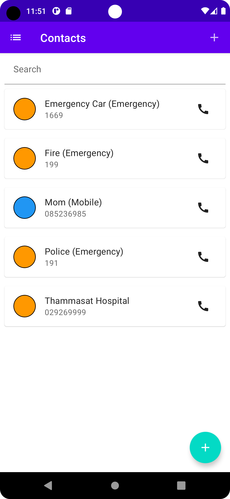
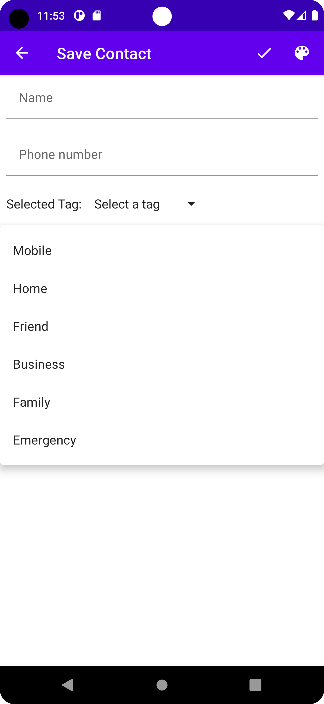
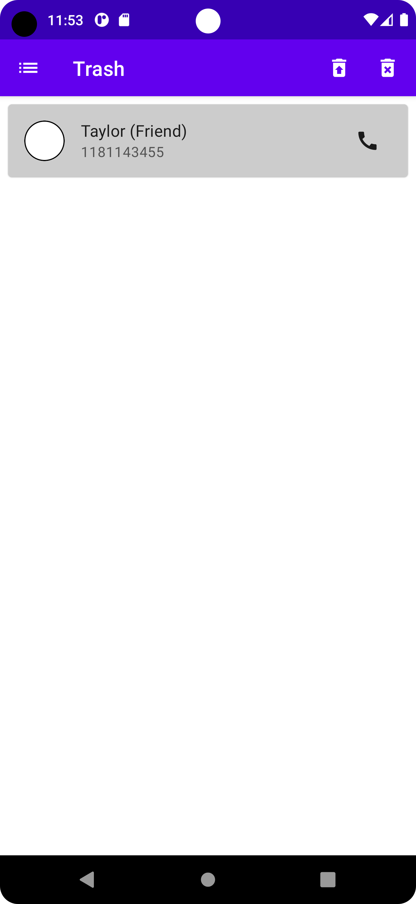
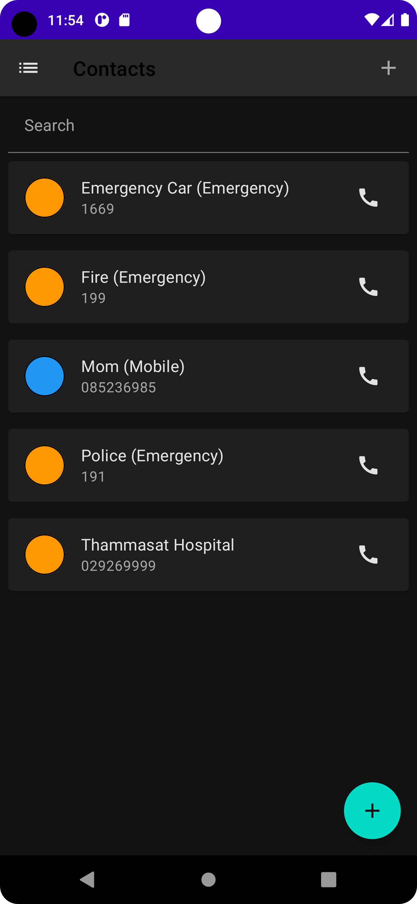

# cn333as5 Phone Book App

### Kantapon Makwong 6310520066

## Mobile Application Function
Android App using jetack composable: Phone Book App 

These are the function of this application
1. Users can browse list of contact that **sorting by name**.
1. Users can **create contact**.
1. Users can **edit contact**.
1. Users can **delete contact** to trash.
1. Users can **restore contact** from trash.
1. Users can **permanently delete contact** from trash.
1. Users can choose the type of **tag** for each contact using dropdown menu.
1. Users can tap for **call** button, app will make user can call that number.
1. Users can **select color** for each contact.
1. Users can **change app theme** (Light theme, Dark theme).
1. Users can **search** for contacts.
1. Input validation.

## Link to video demonstration
[Click Here.](www.google.com)

## This app is developed with

[](https://kotlinlang.org)
[](https://developer.android.com)

## How to run this application
1. Clone this project to your android studio
  ```
  git clone https://github.com/6310520066/cn333as5.git
  ```

2. Make sure you are in master branch
  ```
  git checkout master
  ```

3. Build this project
  ```
  ⌘ + fn + F9 (Mac) OR Shift + F9 (Windows)
  ```

4. Run application
  ```
  ⌘ + fn + F10 (Mac) OR Shift + F10 (Windows)
  ```
  
  OR
 
Import project from version control select GIT and link of repository as follow
```
https://github.com/6310520066/cn333as5.git
```

## Example Display Random Image App

#### Main Scerron of the Application


#### Save contact screen


#### Trash screen


#### Dark theme mode

